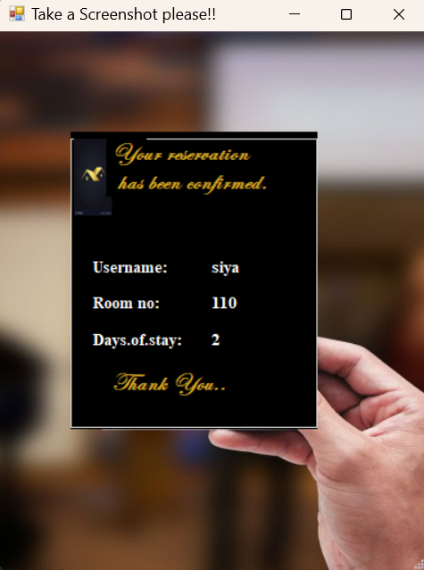

# Hotel Reservation System

A desktop-based hotel booking application developed using **Visual Basic** and **MySQL server**.

## Features
- Room booking and availability check
- Customer registration and management
- Admin panel for managing rooms and bookings
- Check-in / Check-out tracking
- Invoice generation

## Technologies
- Visual Basic (VB.NET)
- MySQL
- Windows Forms

## How to Run
1. Open the project in Visual Studio.
2. Set up the MySQL database (create tables as per code).
3. Configure database connection (ODBC/connection string).
4. Run and test the app.
## Project Screenshots

